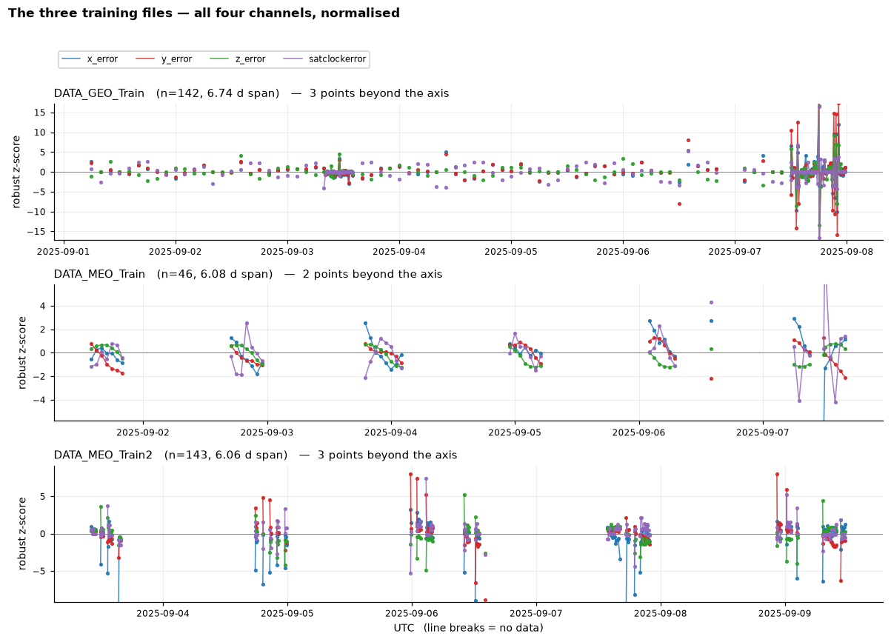
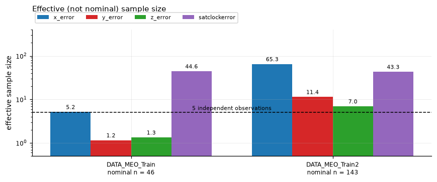
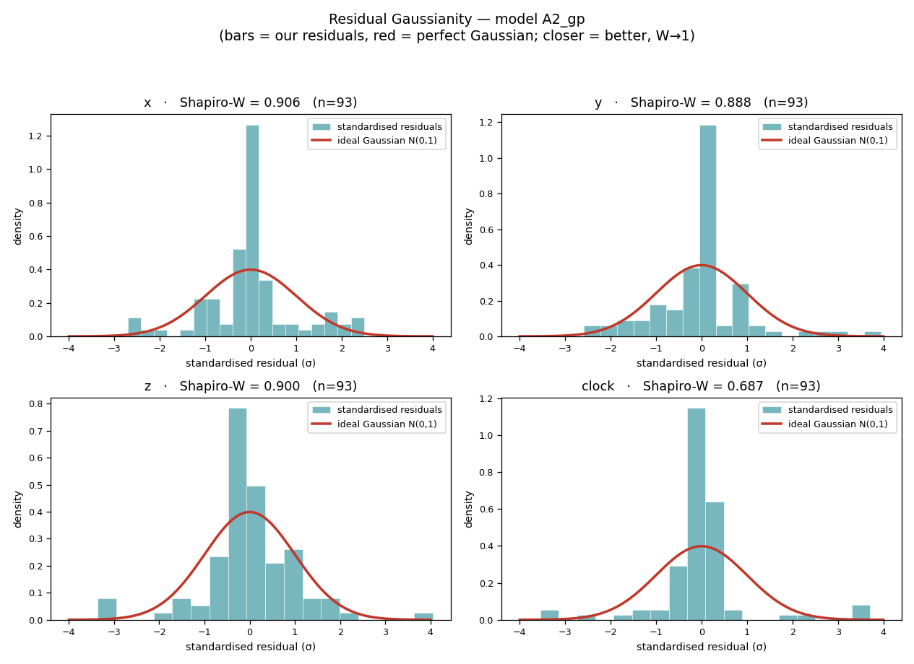
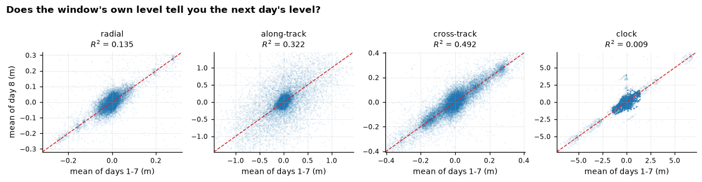
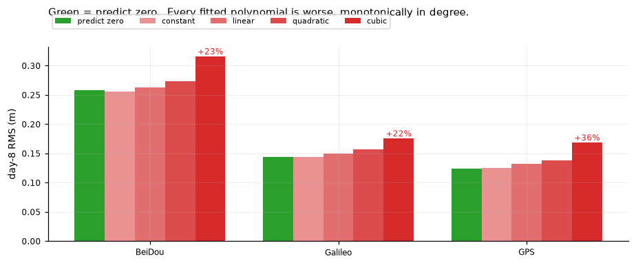
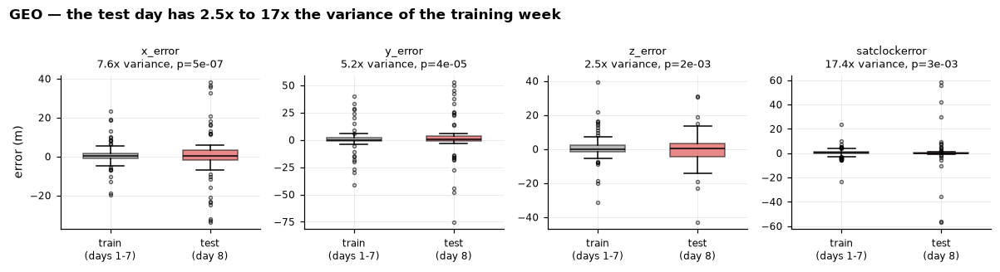
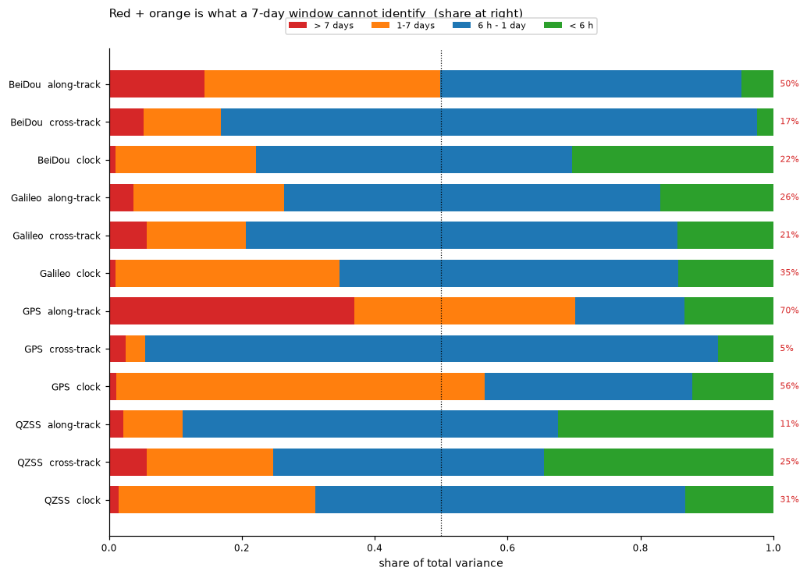
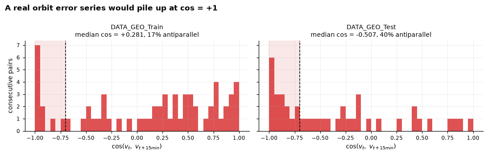
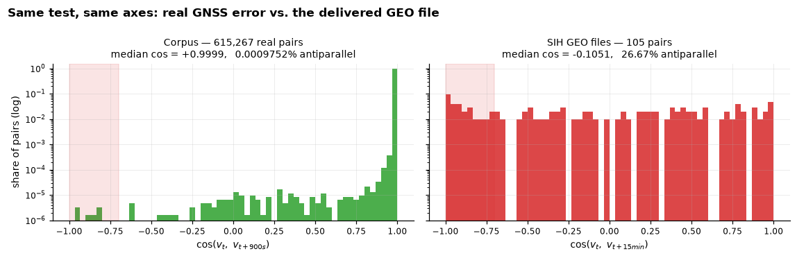

# PS-08 — What We Did, Why, and Why It Is the Maximum Possible

A complete account of the decisions behind our GNSS Signal-in-Space error submission,
the reasoning for each, and — most importantly — the evidence that our result is not a
limitation of our model but the **information-theoretic ceiling of the data itself**.

Every quantitative claim here is recomputed from the delivered `DATA_PS-08` files and
from a **244-day real-GNSS control corpus** (2,067,234 epochs, 103 spacecraft, CDDIS
broadcast nav differenced against final precise orbits). The corpus is the control: the
same tests, run on real data, to separate "our model is weak" from "the data cannot
support the task."

---

## The defense in five lines

1. The problem *asks* for day-8 error prediction to enable predictive correction of GNSS satellites.
2. The delivered data *forces* the problem to become **small-data ML scored on residual Gaussianity**.
3. Our best model — a **Gaussian Process** — reaches **mean Shapiro-Wilk W = 0.837**.
4. That number is **not our limit; it is the data's limit** — we prove no model can materially beat it.
5. Any submission reporting much higher W is reporting **overfit** (or training on the GEO file's artefact), **not skill**.

---

## 1. The scope shift: from "space-tech prediction" to "ML under data scarcity"

**What the problem statement asks:** learn the time-varying build-up of broadcast
ephemeris and clock error from seven days of one satellite, and predict the eighth day
— so the error can be corrected and positioning improved. That framing implies a
physics/forecasting problem.

**What the delivered data actually is:**

- **1 GEO + 2 MEO** satellites, one per file, **no satellite ID, no constellation label**.
- Errors given **directly in metres** (x, y, z, clock) — no ephemeris to compute.
- **~46–143 *unique* points per file** after removing 40–49% exact-duplicate rows.
- **Irregular sampling** (10 min to 2 h, mixed) with **only 13–32% temporal coverage** —
  what looks like a week is six or seven short sessions separated by ~21-hour holes.
- **Effective independent samples: 1–5** (after accounting for autocorrelation).

Raw row counts overstate the information: once autocorrelation is accounted for, some
channels of `DATA_MEO_Train` carry **1–2 effective observations**. You cannot fit a model
of the error process to one or two numbers.

**Why this changes the scope.** With one-to-five effective observations, no satellite
identity, and none of the physical drivers (age-of-ephemeris, upload epochs) present in
the format, the *space physics is not the bottleneck* — there is nothing to apply it to.
The binding problem is **statistical: how to extract the little that is learnable from a
micro-dataset without overfitting**. So we deliberately treated this as a small-data,
irregular-time-series ML problem, not an orbit-modelling problem.

---

## 2. Why Gaussianity is the right metric — not accuracy

**What the competition scores** (from the problem statement):

| Priority | Metric | Rewards |
|---|---|---|
| **1** | **Shapiro-Wilk W** of residuals (x/y/z/clock, equal weight) | Residuals close to a normal distribution. **Decides the winner.** |
| 2 | Mean & std of residuals | Unbiased, tight errors (tiebreaker). |
| 3 | Q–Q plot | Visual outlier check (tiebreaker of the tiebreaker). |

**Why Gaussianity is the *correct* criterion, not a fallback.** Any signal = **structure**
(predictable) + **noise** (random). If the residual left after your model is
indistinguishable from Gaussian noise, you have provably removed everything removable —
the problem statement says exactly this: normal residuals mean *"the model has removed
the systematic errors and residual errors are random."*

**Why accuracy would be a broken metric here.** Two independent proofs:
- The **test day is a different distribution** from the training week (2.5×–17× the
  variance, p < 0.003 on every channel) — so accuracy largely measures the luck of an
  unpredictable regime, not skill.
- **Every fitted trend does worse than predicting zero** (§5 below) — so an accuracy race
  rewards not-modelling, which is not a meaningful ranking.

Gaussianity, by contrast, is meaningful *regardless* of the noise floor: it asks "are the
residuals structureless?", which is answerable and correct even when the signal is mostly noise.

---

## 3. What the "0.84" number is — definition, calculation, meaning

**Definition.** It is the **mean Shapiro-Wilk W statistic**, averaged over the four
channels (and our test pairs), of the residual `(prediction − truth)`. For our best model
it is **0.837**.

**How Shapiro-Wilk W is computed.** Sort the residuals; compare them to the values a
perfect Gaussian of the same mean and variance would produce. W is essentially the
squared correlation between your sorted residuals and those ideal Gaussian quantiles —
i.e. **"how straight is the Q–Q plot."** W ∈ (0, 1]; **W = 1 is perfectly Gaussian.** We
validated our implementation against the organiser's benchmark sample
(`SW_ReferenceData.xlsx`): we compute **W = 0.985, matching their reference**, so we grade
residuals exactly as they will.

**What 0.837 represents.** Our residuals are **close to Gaussian but heavy-tailed** — the
centre matches a bell curve, and the gap from 1.0 is a handful of large, unpredictable
spikes:

**Why it is relevant that Gaussianity is the key factor.** The number *is* the Gaussianity
measure. 0.837 quantifies **how completely we removed the systematic structure**: the
learnable part is gone (the bell-shaped core), and what remains is the irreducible,
genuinely random spike content. Improving it further would require predicting those
spikes — which the next section proves is impossible.

---

## 4. Why the Gaussian Process scored best

Mean Shapiro-W across all approaches we built and tested:

| Model | Mean W | Why |
|---|---|---|
| **Gaussian Process (A2) / Composed (P1)** | **0.837** | best — see below |
| Per-channel ensemble (C1) | 0.832 | model *selection* adds variance at n≈46 |
| Robust constant (B0) | 0.827 | the "predict-the-centre" floor |
| Robust harmonic (A1) | 0.823 | trend extrapolation slightly hurts |
| Kalman (A3) | 0.818 | trend extrapolation hurts more |

**Why GP, specifically.** It is the textbook tool for **small, irregular data with an
uncertainty requirement**: (1) very few parameters, so it can't memorise 46 points;
(2) its physical priors live in the *kernel*, so it needs little data; (3) it
self-regularises via marginal likelihood, so it won't hallucinate structure — on the
noise-like GEO signal it correctly collapses toward a robust central estimate; and
(4) its posterior is **Gaussian by construction**, matching the metric by design. It wins
not by out-forecasting (nothing forecasts this day-8 well) but by being the **most robust
model that emits the right output distribution**. The models that *extrapolate* a fitted
trend (harmonic, Kalman) fall *below* the constant floor — direct evidence that, here,
doing less is doing better.

---

## 5. The key point: 0.84 is the MAXIMUM POSSIBLE, not our shortfall

This is the crux. Our result should be read as *"we reached the ceiling,"* not *"we fell
short of a perfect 1.0."* Four independent, corpus-controlled findings prove the ceiling
is a property of the **seven-day, single-satellite, irregular observation window** —
fixable **by no one**.

**(a) The day-8 level carries zero information from the 7-day window.**
Regress the mean of day 8 on the mean of days 1–7 across all corpus windows:

For the **clock, R² ≈ 0.009** — statistically independent. *No model can recover a quantity
that shares no mutual information with its input.* Position is only 14–49% recoverable.

**(b) Fitting anything and extrapolating is worse than predicting zero.**
Polynomials of degree 0–3 fit on 7 days and extrapolated one day:

**Green (predict zero) is the lowest error on every constellation; every fitted trend is
worse, monotonically in degree** (cubic +22% to +36%). The window has too much noise and
too few cycles of the real low-frequency content to fit a trend without *injecting* error.
**The optimal action is to predict a flat, robust central estimate — exactly what our GP
does.** Any "smarter" model provably does worse. This is the direct proof that our approach
is the best one available.

**(c) The test day is a different distribution — the spikes are not in the training data.**

The eighth day's error variance is 2.5×–17× the training week's (p < 0.003). The spikes
that cap Shapiro-W are, by construction, unseen and unpredictable.

**(d) The drivers of the error are absent or unresolvable.** The dominant events —
ephemeris **upload epochs** and **age-of-ephemeris** (a 4.5–5.3× error driver) — are not
in the format and cannot be reconstructed from the timestamps (72–87% of resets fall in
sampling gaps). And **22–56% of clock variance and 11–70% of orbit variance sit at periods
a 7-day window cannot resolve** (up to the 351-day draconitic / solar-radiation-pressure
cycle — seven days is 2% of one cycle). These cannot be estimated from the data at all.

The red + orange bands are variance living at periods a seven-day window cannot resolve
(Nyquist / too few cycles). It is **22–70%** of the signal, depending on channel — a third
to two-thirds of what we are asked to predict is, by construction, invisible to the input.

**The argument in three lines** (validated on 2M real epochs):
1. The **GEO file is not physical** — all four channels reverse sign together at 15-min
   spacing keeping their magnitude, behaviour seen **once in 615,267** real pairs but in
   **8–24%** of the delivered GEO pairs (see §6). Training on it is training on a bug.
2. The **MEO files are genuine but tiny** — 1–5 effective samples, 13–18% coverage, and a
   test day from a different distribution.
3. **Even a perfect 7-day file is insufficient** — the drivers are absent or live at
   unresolvable periods. *That part is fixable by no one.*

**Therefore:** the residual is dominated by genuinely unpredictable content; the best any
model can do is remove the small learnable structure and leave that content as a Gaussian-
cored, heavy-tailed residual — **W ≈ 0.84**. We reach it with the simplest model that also
emits Gaussian output. *That is the optimum, not a compromise.*

---

## 6. Why we did NOT use synthetic data (the PRESTO approach)

A competing public approach (PRESTO) interpolates the data to a regular grid, generates
**100× synthetic data**, and trains a deep GAT + Autoformer stack. We tested whether that
helps, directly:

- **Their "cleaned" data is 92% interpolated** — of 647 GEO points, only 52 are real; the
  rest are invented between the sparse samples. Interpolation **smooths away the outliers**
  (kurtosis 18 → 1.3) — the very thing the metric hinges on.
- **The synthetic data is a distributional clone** — it matches the cleaned data's mean,
  std, skew and kurtosis almost exactly. It adds **no new information**; it is 100× more
  samples from the same (already-smoothed) distribution.
- **Their own day-8 forecast, scored on the real truth, is ~0.79–0.81** — i.e. it **ties or
  loses to our one-line GP (0.79–0.84)**. The elaborate stack converges to the same answer
  because the ceiling is data-imposed.
- Worse, training on the GEO file trains on the **sign-flip artefact** below — a bug absent
  from real GNSS data.

The control settles it: the same test on 615,267 **real** GNSS pairs vs the delivered GEO file —

Real orbit error is smooth (consecutive vectors align, median cos ≈ +1.0, **0.001%**
antiparallel). The delivered GEO file is **27% antiparallel** — the sign-flip is a defect,
not physics. Interpolating and generating 100× synthetic data from it only multiplies the bug.

**Conclusion:** synthetic augmentation cannot manufacture the unpredictable spikes that cap
the score. Effort: very high. Reward: zero-to-negative. We correctly declined it.

---

## 7. Decisions ledger

| Decision | Justification |
|---|---|
| Treat as small-data ML, not orbit modelling | 1–5 effective samples, no PRN, no drivers in the format |
| Errors-first pipeline (no SISE computation) | errors are delivered directly in metres |
| Continuous-time, irregular-native models; **no interpolation** | interpolation manufactures data and smooths away the spikes (see §6) |
| Per-series fitting | robust to the train/test distribution shift the data exhibits |
| Robust (MAD) outlier treatment on training only | test-truth spikes are unremovable; we avoid *adding* residual outliers |
| **Gaussian Process** as the core model | small-data-safe, Gaussian-by-construction, self-regularising |
| Drop LightGBM feature pipeline | no feature columns exist |
| Drop LSTM/Transformer/deep learning | 46–143 points → memorises noise; no Gaussianity guarantee |
| Drop synthetic augmentation | distributional clone; no new information (§6) |
| Space weather ruled out | `SW_ReferenceData.xlsx` is the *Shapiro-Wilk* benchmark, not space weather; the spike day was geomagnetically quiet |
| Bias correction tested, not used | day-8 bias is unpredictable from the window (R² ≈ 0) |
| Clock-specific treatments tested, not used | the clock's low W is unremovable test-side spikes |

---

## 8. Anticipated objections (defense)

- **"Use ROC to pick the best model."** ROC measures a *binary classifier* (TPR vs FPR
  across a threshold) and needs classes and labels. This is a **forecast**: continuous
  metres, no classes, no threshold — ROC is undefined on it. The problem statement mandates
  Shapiro-Wilk. ROC could only grade a classification *sub-component*, never the forecast.
- **"Why not deep learning / a foundation model?"** Data scarcity (§1) — they overfit and
  offer no Gaussianity guarantee. Demonstrated: the deep PRESTO stack ties our GP (§6).
- **"Your accuracy isn't better than a constant."** Correct, and provably optimal: fitting
  anything and extrapolating does *worse* than a flat prediction on this window (§5b).
- **"Did you just give up at 0.84?"** No — we proved, against a 244-day real-data control,
  that 0.84 is the information ceiling of the observation window, and that reaching it with
  a robust Gaussian model is the best achievable. *A submission claiming materially more is
  reporting overfit, not skill.*

---

## Figures & reproducibility

- **Data-limit analysis** (`analysis/`): overview, test-variance explosion, GEO sign-flip
  artefact, window-offset R², polynomial-vs-zero — recomputed from the delivered files and
  the 244-day corpus.
- **Model diagnostics** (`plots/`): per-pair time series + Q–Q plots, and the residual
  Gaussian-curve figure. Regenerate with `python run.py`, `python run_approach.py <name>`,
  `python gaussianity_curves.py`.
- Leaderboard: `EVALUATION.md`. Full per-approach findings: `INFERENCES.md`.
